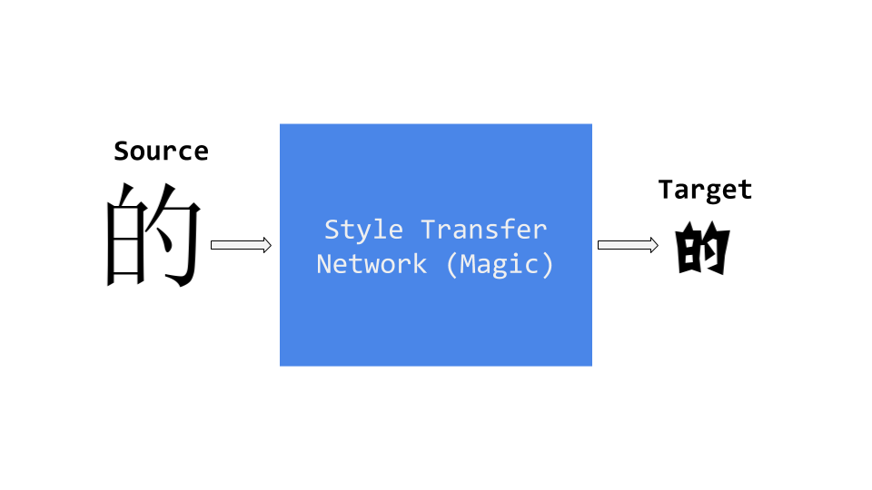
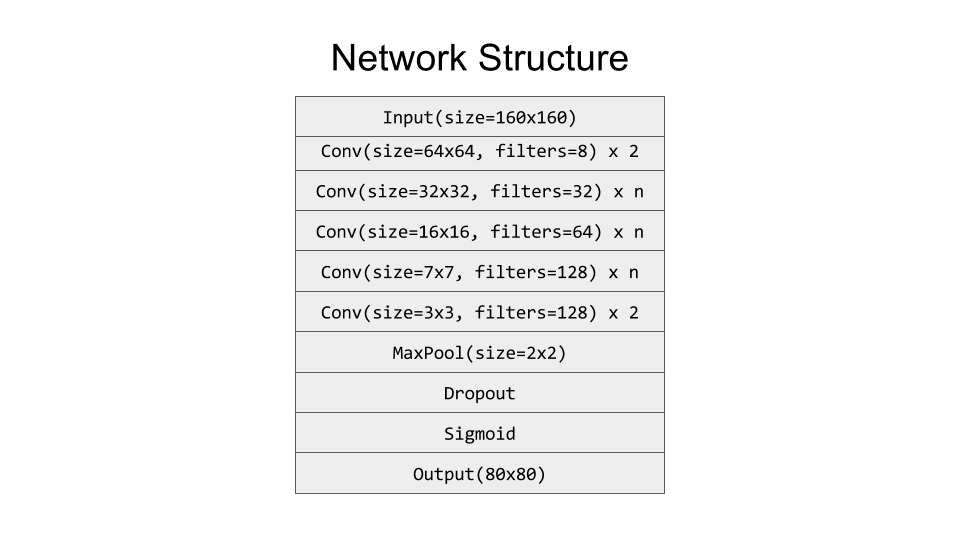

#Rewrite: Neural Style Transfer For Chinese Fonts
<p align="center">
  
</p>

## Motivation
Creating font is a hard business, creating a Chinese font is an even harder one. To make a GBK (a character set  standardized by Chinese government) compatible font, designers will need to design unique looks for more than 26,000 Chinese characters, a daunting effort that could take years to complete. 

What about the designer just creates a subset of characters, then let computer figures out what the rest supposed to look like? After all, Chinese characters are consisting of a core set of radicals(偏旁部首), and the same radical looks pretty similar on different characters. 

This project is an explorational take on this using deep learning. Specifically, the whole font design process is formulated as a style transfer problem from a standard look font, such as [SIMSUN](https://www.microsoft.com/typography/Fonts/family.aspx?FID=37), to an stylized target font. A neural network is trained to approximate the transformation in between two fonts given a subset of pairs of examples. Once the learning is finished, it can be used to infer the shape for the rest of characters. Box below illustrated this general idea:


This project is heavily inspired by the awesome blog [Analyzing 50k fonts using deep neural networks](https://erikbern.com/2016/01/21/analyzing-50k-fonts-using-deep-neural-networks/) from Erik Bernhardsson, and great paper [Learning Typographic Style](https://arxiv.org/pdf/1603.04000.pdf) from Shumeet Baluja.

## Network Structure
After trying various different architectures, including more sophisticated ones with residuals and deconvolution, I ended up with a more traditional flavour top-down CNN structure, as shown below.


### Notes & Observations: 
* Each Convolutional layer is followed by a Batch Normalization layer then a ReLu layer, and zero padding all the way down.
* The network is minimized against pixel wise **MAE**(Mean Absolute Error) between predicted output and ground truth, rather than than more commonly used **MSE**(Mean Square Error), as mentioned in Erik's blog. MAE tends to yield sharper and cleaner image, while MSE falls to more blurred and grayish ones. Also [total variation loss](https://en.wikipedia.org/wiki/Total_variation_denoising) is applied for image smoothness.
* Layer number **n** is configurable, the larger n tends to generate more detailed and cleaner output, but takes longer time to train, usual choice is between [2, 4]. Choice larger than 4 seems hitting the point of diminishing return, increasing in running time but no noticeable improvement on either loss or output.
* **Big convolutions** for better details. During my experiments, I started out using stacked straight up plain 3x3 convolutions, but it end up performing badly or not converging on more difficult and exotic fonts. So I end up this trickling down shape architecture, with various size of convolutions on different layers, each contains about the same number of parameters, so the network can capture details at different level.
* **Dropout** is essential for convergence. Without it, the network simply gives up or trapped in trivial solutions, like all white or black images.
* Fully-Connected layers used in both Erik and Shumeet's work didn't work very well for Chinese characters, generating noisier and unstable output. My guess is that Chinese characters are much more complex in structure and by nature closer to images than letters, so a CNN based approach makes more sense in this case.
* Unlike real world image, we can generate image of a character with arbitrary resolution. This fact can be exploited to use a high-res source image to approximate a low-res target, thus more details are preserved and to avoid blurriness and noise.

##Visualizations
###Progress during training
The image on the top shows the progress of model made on validation set during training, on various fonts. All of the them are trained on 2000 examples with layer number set to 3. It is pretty interesting to see how the model slowly converges from random noise, to first capture the recognizable shape of a character, then to more nuanced details. Below is the progress captured for a single font during training.
<p align="center">
  
</p>
###Compare with ground truth
The image below shows the predicted result versus ground truth. For each font, we take 2000 most used characters as training set, running for 3000 iterations. A test set with 100 characters are used for inference. For all the fonts, the source font is SIMSUN.

<p align="center">
  
</p>

For majority of the fonts, the network succeeds to make reasonable guesses. Some of them are actually very close to the ground truth. Also worth noting, the tiny but distinguishable details are preserved by the network, like the curly end of radicals.

But just like many other neural network powered applications, when the network fails, it fails spectacularly. For some fonts, especially the ones that are light in weight, it merely comes up some blurry inky blob. On the other hand, for those heavy fonts, it loses critical details of blanks to make the character distinguishable, only capturing the overall outline. Even in the successful cases, the loss of parts of radicals seems like a common problem. Also, network seems to do better on SongTi family(宋体 or 明朝体) of fonts, but didn't do well on KaiTi(楷体), which may due to the fact that SIMSUN itself is a SongTi font.

Because the limitation of space, for each font, we randomly sample one character from test set. If you wish to see the result on bigger test set of characters, please refer to [this](https://github.com/kaonashi-tyc/Rewrite/blob/master/images/bigger_test.png)
###How many characters are needed?
2000 characters may be 10% of the whole GBK standard, but these are still a lot of characters. I choose the number out of my instinct, and it seems work well for many fonts. But is it really necessary?

To figure this out, I pick one font(it takes way too much time to carry this experiment on every font, sadly), run an experiment with number of training examples, ranging from 500 to 2000, and ask the model to render characters on a common test set, below shows the result.

<p align="center">
  
</p>

The above image shows from top to bottom, the effect of increasing size of training set from 500 to 2000. The improvement becomes smaller between training 1500 and 2000, which indicates that the sweet point is somewhere in between.
##Usage
###Requirements
To use this package, TensorFlow is required to be installed (tested on 0.10.0 version). Other python requirements are listed in the requirements.txt. Also a GPU is **highly** recommended, if you expect to see the result in reasonable amount of time. 

All experiments run on one Nvidia GTX 1080. For 3000 iterations with batch size 16, it takes the small model about 20 minutes to finish, while 80 minutes for the medium one, and 2 hours for big model.
###Example
Prior to training, you need to run the preprocess script to generate character bitmaps for both source and target fonts:

```sh
python preprocess.py --source_font src.ttf \
                     --target_font tgt.otf \
                     --char_list charsets/top_3000_simplified.txt \ 
                     --save_dir path_to_save_bitmap
```
The preprocess script accepts both TrueType and OpenType fonts, take a list of characters (some common charsets are builtin in the charsets directory in this repo, like the top 3000 most used simplified Chinese characters) then save the bitmaps of those characters in **.npy** format. By default, for the source font, each character will be saved with font size 128 on a 160x160 canvas, and target font with size 64 on 80x80 canvas, with respect. No special alignment is needed here, just make sure characters don't get truncated.

After the preprocess step, assume you already have the bitmaps for both source and target fonts, noted as **src.npy** and **tgt.npy**, run the below command to start the actual training:

```sh
python rewrite.py --mode=train \ 
                  --model=medium \
                  --source_font=src.npy \
                  --target_font=tgt.npy \ 
                  --iter=3000 \
                  --num_examples=2100 \
                  --num_validations=100 \
                  --tv=0.0001 \
                  --alpha=0.2 \
                  --keep_prob=0.9 \ 
                  --num_ckpt=10 \
                  --ckpt_dir=path_to_save_checkpoints \ 
                  --summary_dir=path_to_save_summaries\
                  --frame_dir=path_to_save_frames
```
Some explanations here:

* **mode**: can be either *train* or *infer*, the former is self-explanatory, and we will talk about the infer mode later.
* **model**: here represents the size of the model. 3 options are available: small, medium or big, with respect to the number of layers equal to 2,3,4.
* **tv**: the weight for the total variation loss, default to 0.0001. If the output looks broken or jarring, you can choose to boost it to force the model to generate smoother output
* **alpha**: the alpha slope used by leaky relu. Enable it might see some improvement for certain fonts but subject to longer training time.
* **keep_prob**: represents the probability a value passing through the Dropout layer during training. This is actually a very important parameter, the higher the probability, the sharper but potentially broken output is expected. If the result is not good, you can try to lower value down, for a noisier but rounder shape. Typical options are 0.5 or 0.9.
* **ckpt_dir**: the directory to store model checkpoints, used for latter inference step.
* **summary_dir**: if you wish to use TensorBoard to visualize some metrics, like loss over iterations, this is the place to save all the summaries. Default to /tmp/summary. You can check the loss for training batch, as well as on validation set, and the breakdown of it.
* **frame_dir**: the directory to save the captured output on **validation** set. Used to pick the best model for inference. After the training, you can also find a file named **transition.gif** to show you the animated progress the model made during training, also on validation set.

For other options, you can use the **-h** checkout the exact usage case.

Suppose we finish training (finally!), now we can use the **infer** mode mentioned previously to see how the model is doing on unseen characters. You can refer to the captured frames in the frame_dir to help you pick the model that you are most satisfied with (Spoiler: it is usually not the one with minimum error). Run the following command

```sh
python rewrite.py --mode=infer \
                  --model=medium \
                  --source_font=src.npy \
                  --ckpt=path_to_your_favorite_model_checkpoints \
                  --bitmap_dir=path_to_save_the_inferred_output
```
Note the source_font can be different from the one used in training. In fact, it can even be any other font. But it is better to choose the same or similar font for inference for good output. After the inference, you will find series of images for all output characters and a npy file that contains the inferred character bitmaps.

## Discussion & Future Work
This project started out as a personal project to help me learning and understanding TensorFlow, but shapes up to be something more interesting, that I think worthy sharing with more people. 

Currently, the network can only manages to learn one style at a time, it will be interesting to see how to extend it to handle multiple styles at once. 2000 characters are fewer than 10% of the complete GBK sets, but it is still a lot of characters, is it possible to learn style with something fewer than 100 characters? My guess is GAN(Generative Adversarial Network) could be really useful to try for this purpose.

On network design, this architecture is proven effective on different fonts, but what is the optimal number of layers for each size of convolutions remains to be figured out, or whether some convolution layers are necessary at all.

Another interesting direction I would love to explore is create font with mixed styles. Simply combining two fonts in the loss function didn't work well. Maybe we should train a VGG network just for fonts, then hijacking the feature maps? Or potentially more novel change in network design is required to tackle this.

Last but not least, this project demonstrates a possibility of applying deep learning, more specifically, CNN in helping accelerating design process for Chinese fonts. The results are promising and encouraging, but not quite there to magically create new font out of box, nor it is part of the claim of this project.

## Thanks & Useful Marterials
* Google's awesome [tutorial](https://www.tensorflow.org/versions/r0.11/tutorials/mnist/pros/index.html) for tensorflow.
* Supplementary [material](http://cs.stanford.edu/people/jcjohns/papers/eccv16/JohnsonECCV16Supplementary.pdf) from [Justin Johnson](https://github.com/jcjohnson) on fast neural style transfer network.
* Great [video](https://www.youtube.com/watch?v=NKiwFF_zBu4) from Ian Goodfellow. Awesome stuff, so practical and illustrate many good points about how to approach a problem with Deep Learning, that after watching it, I feel there is no need to make my own notes.
* Thanks my friend Guy for helping me build a PC with a reasonable budget.
* Thanks my employer [Flipboard](https://about.flipboard.com/) for offering the chance to do this as my 20% time project

## LICENSE
GPLv3